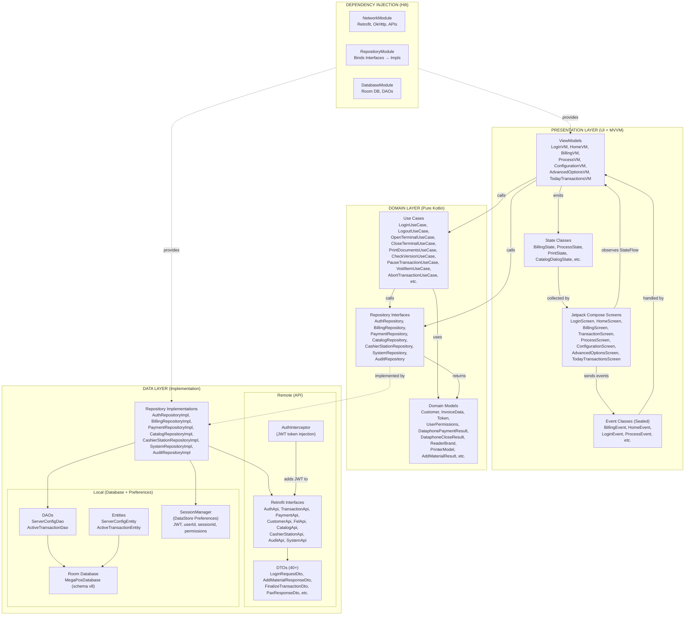
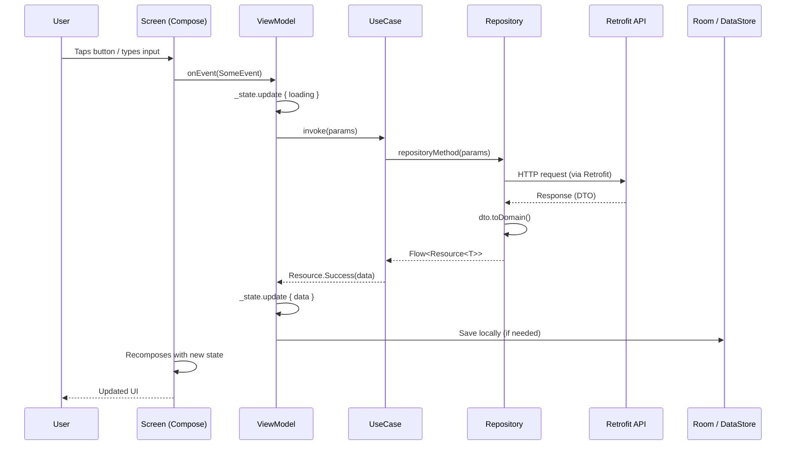
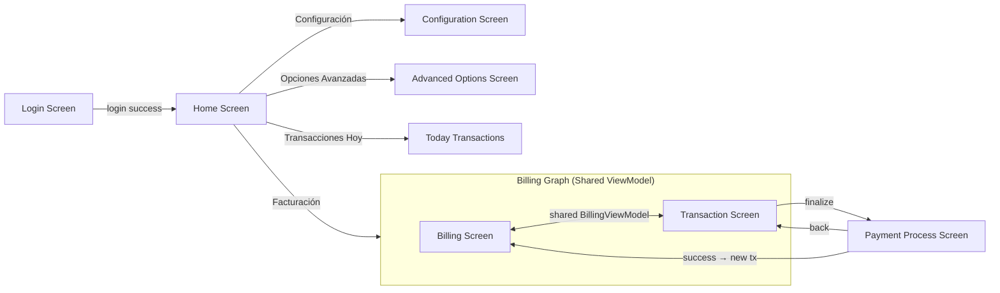
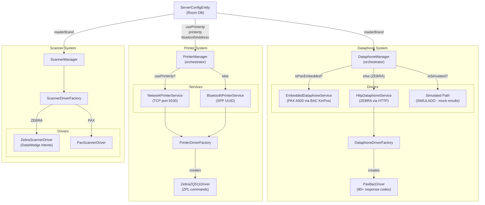
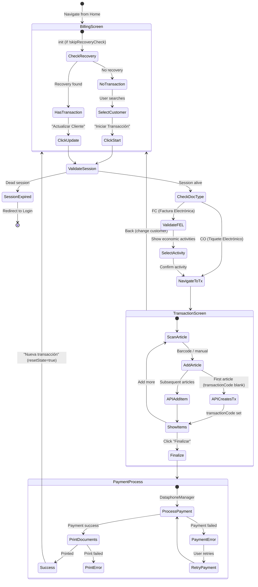
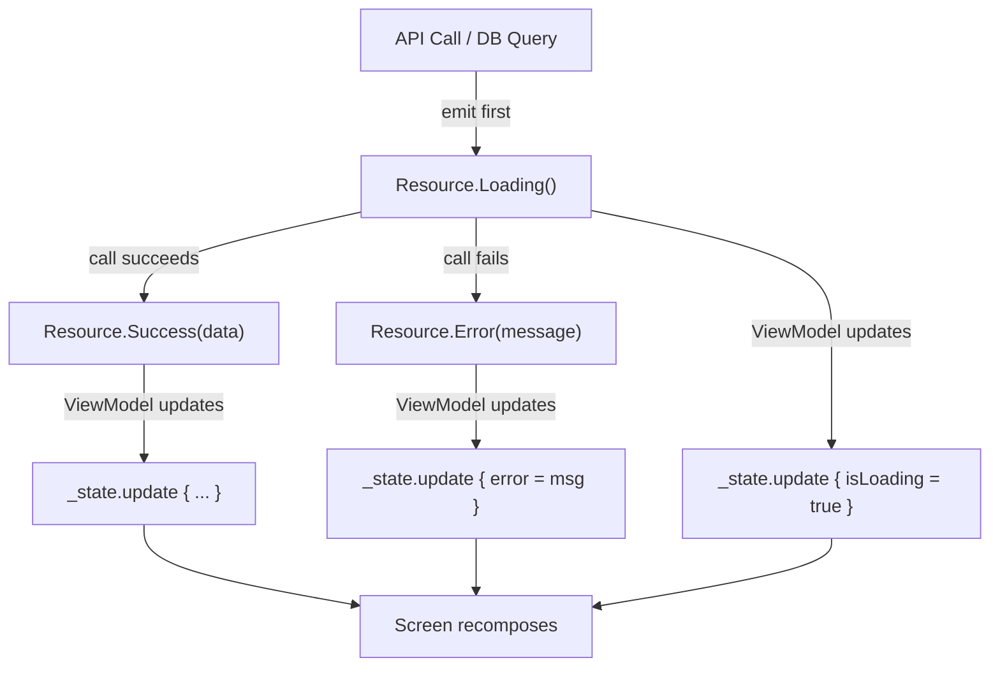

# MegaPosMobile Architecture Diagrams

## 1. High-Level Clean Architecture



## 2. Data Flow: How a User Action Reaches the API and Back



## 3. Navigation Graph



## 4. Peripheral Integration (Driver/Factory Pattern)



## 5. Billing Flow (Detailed)



## 6. Resource Wrapper Pattern



## 7. Project File Structure

```
app/src/main/java/com/devlosoft/megaposmobile/
│
├── MainActivity.kt                    # Single Activity (Compose)
├── MegaPosApplication.kt             # Hilt Application
│
├── presentation/                      # UI LAYER
│   ├── navigation/
│   │   ├── NavGraph.kt               # All routes & navigation
│   │   └── Routes.kt                 # @Serializable route definitions
│   ├── shared/components/            # Reusable UI components
│   ├── login/                        # Login feature
│   ├── home/                         # Home dashboard
│   ├── billing/                      # Billing + Transaction (nested graph)
│   │   ├── state/                    # Sub-state classes
│   │   └── components/              # Billing-specific components
│   ├── process/                      # Payment processing
│   ├── configuration/                # Server config
│   ├── advancedoptions/              # Device settings
│   └── todaytransactions/            # Transaction history
│
├── domain/                            # DOMAIN LAYER
│   ├── model/                        # Domain models (pure Kotlin)
│   ├── repository/                   # Repository interfaces
│   └── usecase/                      # Business logic use cases
│       └── billing/                  # Billing-specific use cases
│
├── data/                              # DATA LAYER
│   ├── remote/
│   │   ├── api/                      # Retrofit interfaces
│   │   │   └── interceptor/          # JWT AuthInterceptor
│   │   └── dto/                      # Data Transfer Objects (40+)
│   ├── local/
│   │   ├── database/                 # Room DB (MegaPosDatabase)
│   │   ├── dao/                      # Data Access Objects
│   │   ├── entity/                   # Room entities
│   │   └── preferences/             # DataStore (SessionManager)
│   └── repository/                   # Repository implementations
│
├── core/                              # PERIPHERAL & UTILITIES
│   ├── dataphone/                    # Dataphone drivers & services
│   │   └── drivers/                  # PaxBacDriver
│   ├── printer/                      # Printer drivers & services
│   │   └── drivers/                  # ZebraZQ511Driver
│   ├── scanner/                      # Scanner drivers & services
│   │   └── drivers/                  # Zebra & PAX drivers
│   ├── session/                      # InactivityManager
│   ├── common/                       # Resource, ApiConfig, Constants
│   ├── constants/                    # FieldLengths
│   ├── extensions/                   # Kotlin extensions
│   ├── state/                        # Peripheral state enums
│   └── util/                         # Bluetooth, Network, JWT utils
│
├── di/                                # HILT MODULES
│   ├── NetworkModule.kt
│   ├── RepositoryModule.kt
│   └── DatabaseModule.kt
│
└── ui/theme/                          # Compose Theme
```
